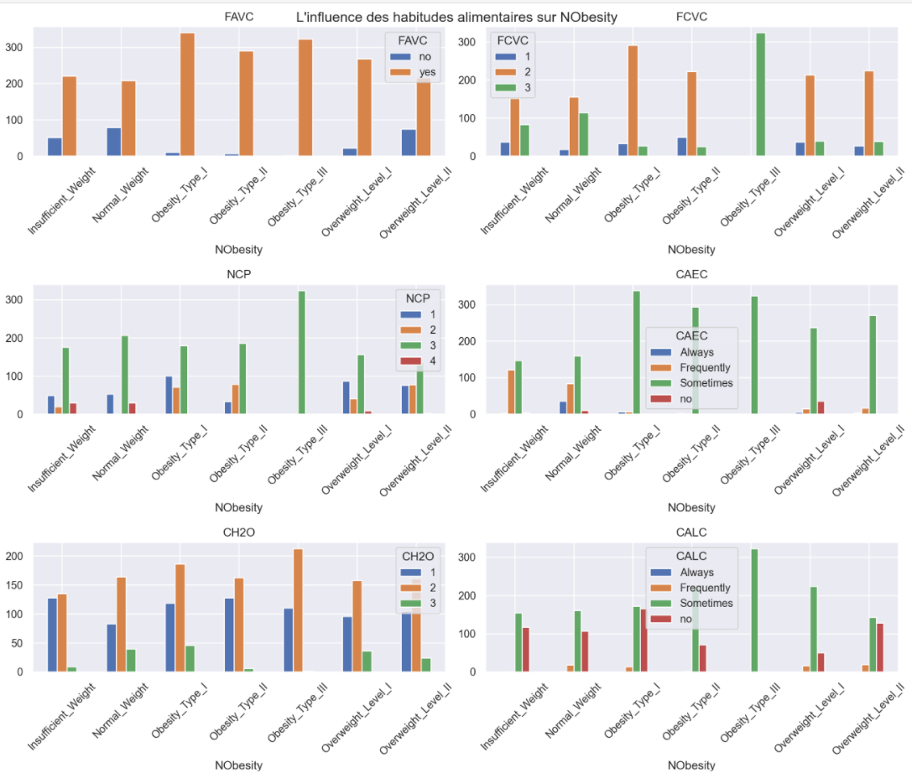
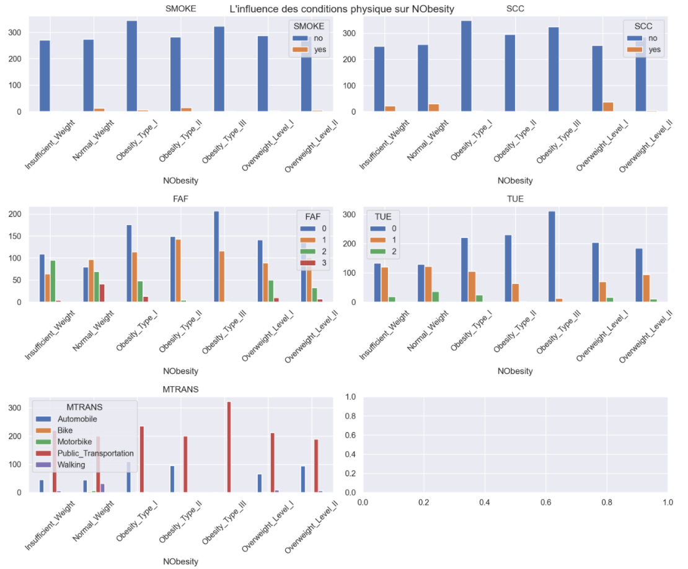
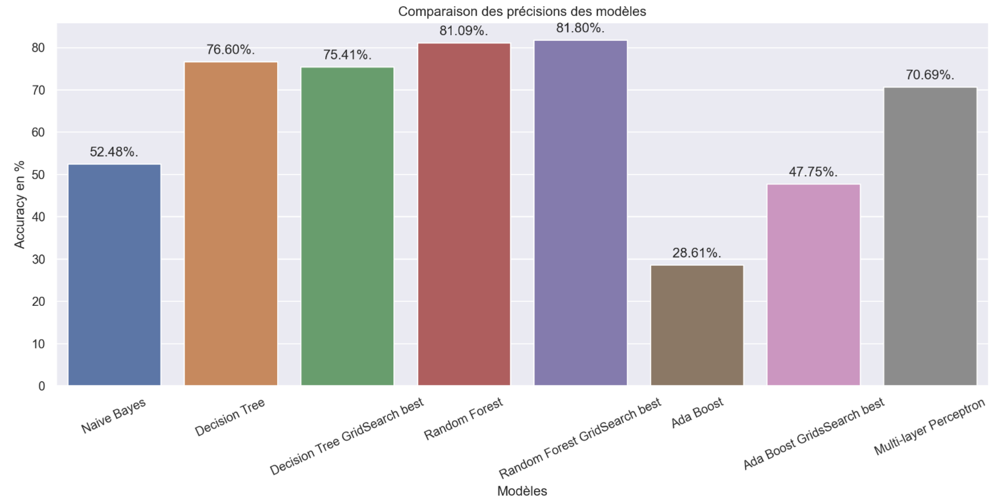
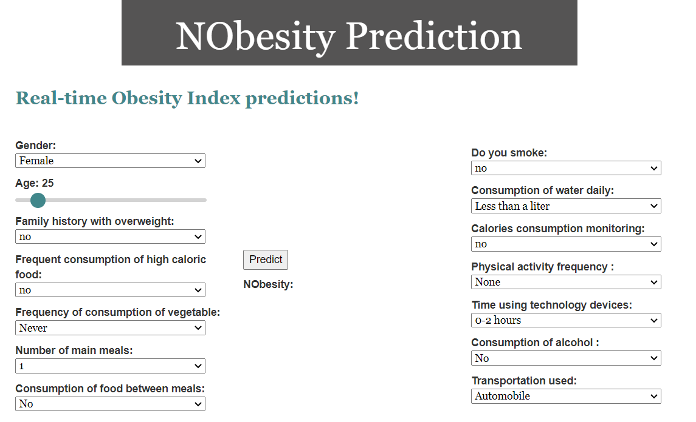
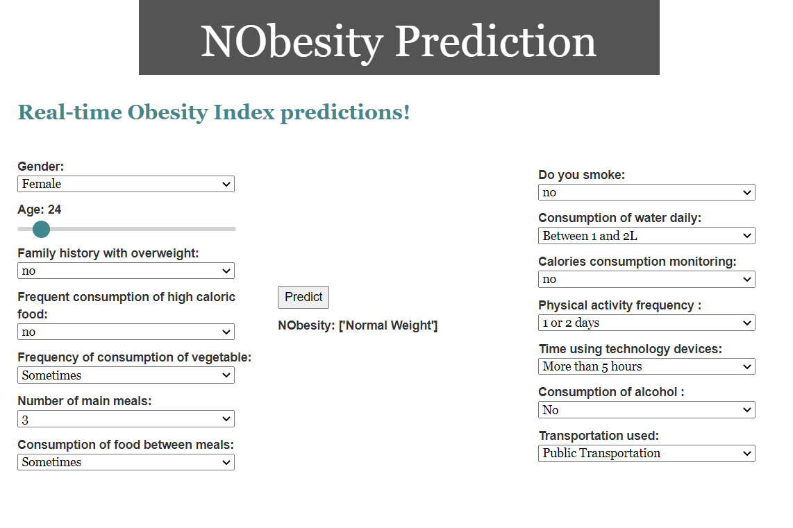

# Obesity Data Analysis
Final project Python for Data Analysis
by Carla CAUCHE

## Dataset

Dataset for estimation of obesity levels based on eating habits and physical condition in individuals from Colombia, Peru and Mexico

https://archive.ics.uci.edu/ml/datasets/Estimation+of+obesity+levels+based+on+eating+habits+and+physical+condition+

The dataset contains the following information :

Feature | Type | Meaning
:------: | :------: | :------:
Gender   | {"Female","Male"}  |
Age| int |
Height | meters |
Weight | kg |
Family history w/ overweight | {"yes","no"} |
Frequent consumption of high caloric food (FAVC) |{"yes","no"} |
Frequency of consumption of vegetables (FCVC)| 1, 2, 3| 1:Never; 2:Sometimes; 3:Always
Number of main meals (NCP)| int |
Consumption of food between meals (CAEC)| {"No","Sometimes","Frequently","Always"} |
Smoke | {"yes","no"} |
Consumption of water daily (CH2O)| 1, 2, 3 |1:Less than a liter;  2:Between 1 and 2L;  3:More than 2L
Calories consumption monitoring (SCC)| {"yes","no"} |
Physical activity frequency (FAF) | 0, 1, 2, 3 | 0:None; 1:1 or 2 days; 2:2 or 4 days; 3:4 or 5 days
Time using technology devices (TUE) | 0, 1, 2 | 0:0-2 hours; 1:3-5 hours; 2:More than 5 hours
Consumption of alcohol (CALC)| {"No","Sometimes","Frequently","Always"}
Transportation used (MTRANS) | {"Automobile","Bike","Motorbike","Public_Transportation","Walking"} |
NObesity | {"Insufficient Weight", "Normal Weight", "Overweight Level I", "Overweight Level II", "Obesity Type I", "Obesity Type II", "Obesity Type III"}|
      
      
      
23% of the data was collected directly from users through a web platform with a survey and the other 77% was generated synthetically using the Weka tool and the SMOTE filter.

## Goal
With this dataset it is interesting to try to predict "NObesity" according to the eating habits and physical condition of an individual without knowing its weight or height.  

Thus, this will be the goal of this work.

## Data-visualization





## Analysis
Most of our data are categorical, and thus needs to be prepared to be used in a model.

Type | Features
-----| -----
Discret | Age <br> Height <br> Weight
Binary | Family history w/ overweight <br> FAVC <br> SMOKE <br> SCC 
Nominal | Gender <br> MTRANS <br> NObesity
Ordinal | FCVC <br> NCP <br> CAEC <br> CH2O <br> FAF <br> TUE <br> CALC <br>  

## Feature Encoding
Feature | Encoding 
:------: | :------:
Gender   |  0:"Female",1:"Male"
Family history w/ overweight | 1:"yes",0:"no"
Frequent consumption of high caloric food (FAVC)|1:"yes",0:"no"
Frequency of consumption of vegetables (FCVC)| 1:Never, 2:Sometimes, 3:Always
Consumption of food between meals (CAEC)|	0:"No",1:"Sometimes",2:"Frequently",3:"Always"
Smoke| 1:"yes",0:"no"
Consumption of water daily (CH2O)| 1:Less than a liter,  2:Between 1 and 2L,  3:More than 2L
Calories consumption monitoring (SCC)|1:"yes",0:"no"
Physical activity frequency (FAF) | 0:None; 1:1 or 2 days; 2:2 or 4 days; 3:4 or 5 days
Time using technology devices (TUE) | 0:0-2 hours; 1:3-5 hours; 2:More than 5 hours
Consumption of alcohol (CALC)	| 0:"No",1:"Sometimes",2:"Frequently",3:"Always"
Transportation used (MTRANS)	| 1:"Automobile",2:"Bike",3:"Motorbike",4:"Public_Transportation",5:"Walking"
NObesity | 0:"Insufficient Weight", 1:"Normal Weight", 2:"Overweight Level I", 3:"Overweight Level II", 4:"Obesity Type I", 5:"Obesity Type II", 6:"Obesity Type III"

## Models
Since our target *NObesity* is categorical, we want to do a classifacation.
To try to find an avatageous model to predict NObesity, multiple models were tested like :
- Naive Bayes Classification
- Decision Tree
- Random Forest
- Ada Boost
- Multi-layer Perceptron

Their Accuracies are the following :


According to those results, the Random Forest method is the one that as a better performance for our data and target NObesity.
Thus it is the model using Random Forest that we will be using for our API.

## API
I use Flask to create my API and it can be used to predict the Obesity Index (NObesity) of an individal according to some information.  

After running the [app.py](API/app.py) file, with the command ```python app.py``` go the the url : http://localhost:5000/  
That is what you will see :  



After changing the features and click on *Predict*, the API will provide it's prediction as seen :  

  
  
